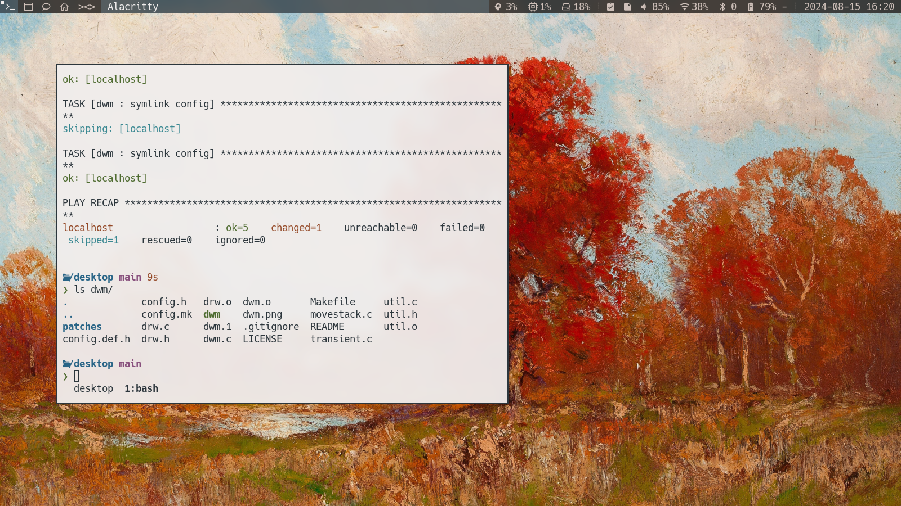
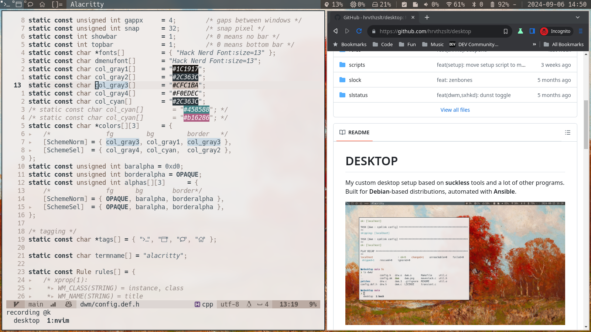

# DESKTOP

My custom desktop setup based on **suckless** tools, built around **dwm**. Built for **Debian**-based distributions, automated with **Ansible**.





## Setup

The following tools have their source code included in the repository and need to be built:

- _clipnotify_: Dependency for _clipmenu_
- _clipmenu_: Clipboard manager
- _dmenu_: Global menu
- _slock_: Screen locker
- _slstatus_: Status bar
- _dwm_: Window manager

### Install

Run all the Ansible playbooks to install all the necessary packages and configurations, and build the tools.

```shell
make install
```

### Build only

Build all the tools in this repository.

```shell
make build
```

Build tools individually.

```shell
make clipmenu dmenu slock slstatus dwm
```

Set up additional tools for an installation without a desktop environment. (Basically set up xinit)

```shell
make barebones
```

## Run

The installation process will create a new session in the display manager, called **dwm**. Select it, and login.

If you're not using a display manager, you can start the window manager with `startx`, or run `make barebones`, which will configure **xinit** to start **dwm** in **tty1** automatically.

## Services

List of services that are set up for this desktop environment:

- _keyd_ - keyboard remapping
- _clipmenu_ - clipboard manager
- _powerprofilesctl_ - power management

## Startup

**dwm** is the entry point for the desktop environment and will start all the other tools.

- _gnome-keyring-daemon_ - start the keyring daemon
- _autorandr_ - restore the monitor configuration
- _sxhkd_ - hotkey daemon
- _dwmblocks_ - status bar for system information
- _clipmenud_ - clipboard manager daemon
- _picom_ - compositor
- _dunst_ - notification daemon

## Keybindings

- **Super + Enter**: Terminal - _alacritty_
- **Super + P**: Runner - _dmenu_
- **Super + Shift + Q**: Quit
- **Super + Shift + L**: Lock
- **Super + Shift + S**: Lock and suspend
- **Super + R**: Restore monitor configuration
- **Super + N**: Network settings - Start _nmtui_ in a floating window
- **Super + U**: Bluetooth settings - Start _bluetuith_ in a floating window
- **Super + S**: Display settings - _arandr_
- **Super + V**: Sound settings - _pavucontrol_
- **Super + M**: Select power profile - _powerprofilesctl_
- **Super + Shift + P**: Clipboard manager - _clipmenu_
- **Super + Shift + C**: Turn off clipboard manager
- **Super + C**: Clear clipboard
- **Super + A**: Close notification - _dunst_
- **Super + Shift + A**: Pause notifications - _dunst_
- **Super + W**: Open web browser - _thorium_
- **Super + E**: Show key presses - _screenkey_
- **Super + Shift + E**: Stop showing key presses - _screenkey_
- **Super + O**: Open file browser - _thunar_
- **Print**: Screenshot - _flameshot_
